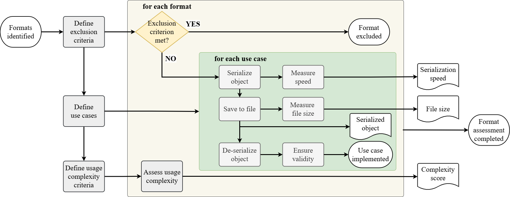

# Data Exchange Format Analysis
This respository contains the output files and results of a comparison of various data exchange formats commonly used in IoT environments.

## Dataset Description
The dataset includes the output files and results of the comparison of the following data exchange formats in terms of space efficiency and speed: Avro, Cap'n Proto (packed and unpacked), FlatBuffers, Thrift, TLV, BSON, CBOR, CSV (with and without header), EXI, FlexBuffers, Hessian, INI, Amazon Ion (textual and binary), Java Serialization, JSON, MessagePack, Protobuf, RDF (RDF/XML and Turtle format), Smile, TOML, UBJSON, XDR, XML and YAML.

The dataset is published via Zenodo and maintained through GitHub.
It supports the research presented in [Towards Sustainable IoT: Space Efficiency and Serialization Speed of Data Exchange Formats](https://doi.org/10.1109/ICE/ITMC65658.2025.11106637).

This folder contains the raw results and serialized use cases in the data formats specified above.

### Experimental Setup

For the comparison, various Java objects were serialized using the 27 data format variants. Those serializations were then written to files that represent the corresponding use cases in all selected data formats (output_files). After the serialized object has been saved, the file size containing this object and the time required for this serialization step are measured and written into two separate files (file_sizes and speed).
The serialized object is then de-serialized again to a Java object. To ensure validity, the original input object and the object de-serialized from the file are compared with each other. If the objects data fields are the same, the implementation for the current use case is considered complete. After serializing all use cases in each format, the complexity of each format is then evaluated based on the defined criteria. This completes the basic evaluation of each data format in terms of space efficiency and serialization speed. This procedure is shown in following figure:



### Data Description

**output_files**: There is a subfolder for each use case. Each use case was serialized once for each data format; these serialized representations are located in this folder.

**file_sizes.xlsx**: This file summarizes the file sizes for each use case and each data format.
Columns:

- "Use Case" (string): Which use case/raw data was serialized? Possible values are HeartData, HttpResponse, ImageData, ImageDescriptor, LocationData, Person, SensorValue, and SmartLightController.
- "Format" (string): Which data format was used? Possible values are Avro, BSON, Cap'n Proto (packed and unpacked), CBOR, CSV (with and without headers), EXI, FlatBuffers, FlexBuffers, Hessian, INI, Ion (textual and binary), Java serialization, JSON, MessagePack, Protobuf, RDF XML and Turtle, Smile, TLV, TOML, Thrift, UBJSON, XDR, XML, and YAML.
- "Value" (Integer): The number of bytes in the output file.

**speed.xlsx**: This file summarizes the measured times that a data format required to serialize a specific use case.
Columns:

- "Use Case" and "Format" (string): See the description of file_sizes.xlsx.
- "Speed" (float): The number of milliseconds that the respective data format required to serialize the use case.
 
## Citation
If you use this dataset, please cite our paper:
```bibtex
@inproceedings{kasper2025towards,
  author    = {Kasper, Bianca and Pawlitzek, René and Hellwig, Michael},
  title     = {{Towards Sustainable IoT: Space Efficiency and Serialization Speed of Data Exchange Formats}},
  booktitle = {2025 IEEE International Conference on Engineering, Technology, and Innovation (ICE/ITMC), Valencia, Spain},
  year      = {2025},
  pages     = {1--10},
  doi       = {10.1109/ICE/ITMC65658.2025.11106637},
  url       = {https://doi.org}
```
and dataset
```bibtex
@dataset{kasper_formats_dataset_2026,
  author       = {Kasper, Bianca and Pawlitzek, René and Hellwig, Michael},
  title        = {{Dataset of IoT Data Exchange Formats}},
  month        = aug,
  year         = 2026,
  publisher    = {Zenodo},
  version      = {v1.0.0},
  doi          = {10.5281/zenodo.21886693},
  url          = {https://doi.org/10.5281/zenodo.21886693}
}
```

## Funding
This work was supported by:
- Interreg ABH: From 04/2023 to 03/2027, the IoT Sustainability Lab is funded by the Interreg VI ”Alpenrhein-Bodensee-Hochrhein programme” with resources provided by the European Regional Development Fund (ERDF) and the Swiss Confederation.
- Interreg BayAT: The project ”AI4GREEN: Data Science for Sustainability” takes place under the funding code BA0100172 as part of the INTERREG programme ”Bayern-Austria” 2021-2027 with cofinancing from the European Union.
- Christian Doppler Research Association: The financial support by the Austrian Federal Ministry of Labour and Economy, the National Foundation for Research, Technology and Development and the Christian Doppler Research Association is gratefully acknowledged.
The funders had no role in study design, data collection, decisions to publish, or paper preparation.


## Contributors
- Bianca Kasper (Research Centre Business Informatics, Vorarlberg University of Applied Sciences)
- René Pawlitzek (Institute for Electronics, Sensors and Actuators, Eastern Switzerland University of Applied Sciences)
- Michael Hellwig (Research Centre Business Informatics, Vorarlberg University of Applied Sciences)

 
